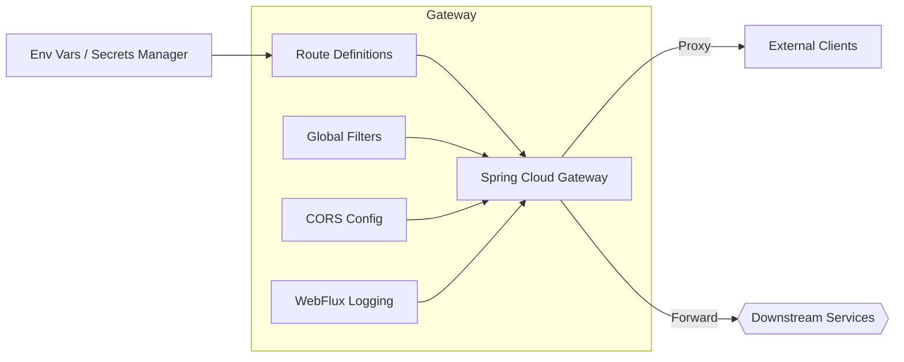
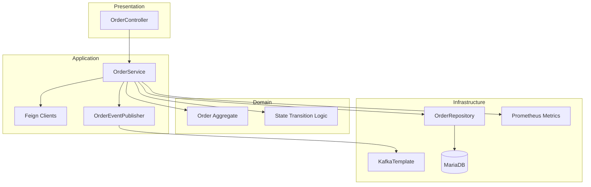
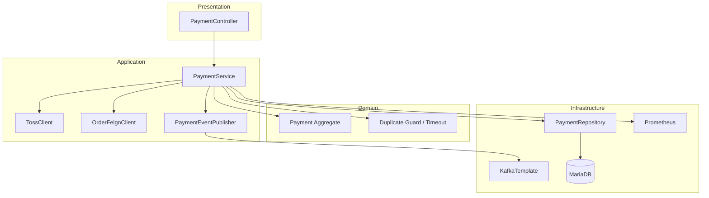
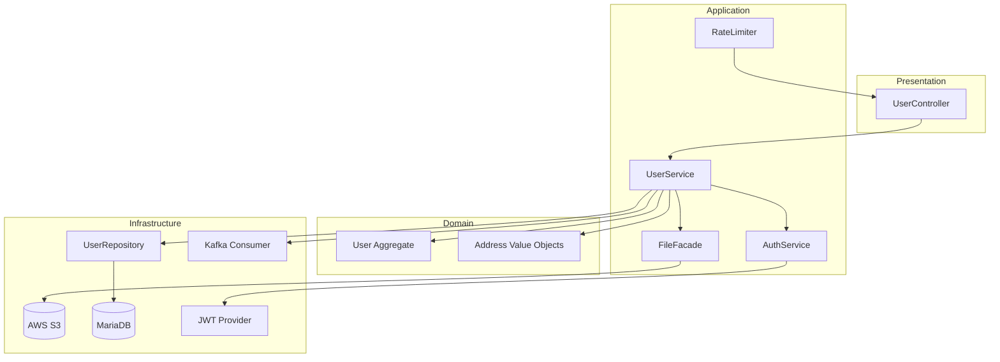
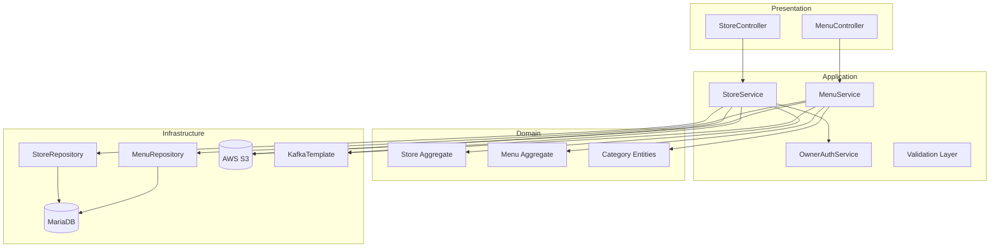
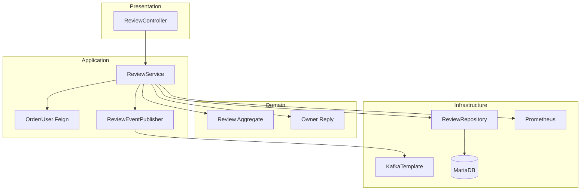
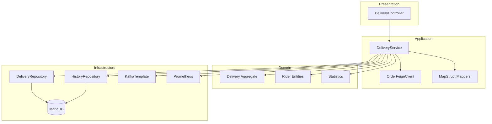
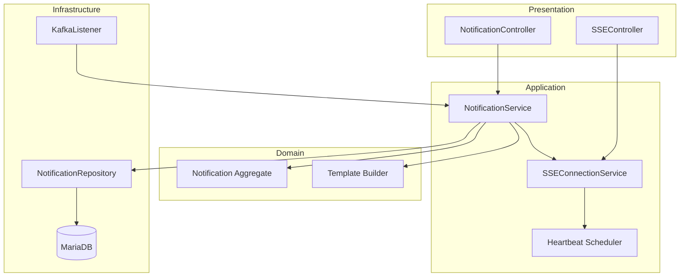

# MSA Service Architecture Visualizations

## Overview
```mermaid
graph TD
    subgraph Gateway
        GW[API Gateway]
    end

    subgraph Services
        ORD[Order Service]
        PAY[Payment Service]
        USR[User Service]
        OWN[Owner Service]
        REV[Review Service]
        DEL[Delivery Service]
        NOTIF[Notification Service]
    end

    subgraph Shared
        KAFKA[(Kafka Broker)]
        RDS[(MariaDB RDS)]
        S3[(AWS S3)]
        AUTH[JWT/Secrets Manager]
        DISC[Service Discovery (Cloud Map)]
    end

    GW -->|Routes| ORD
    GW --> PAY
    GW --> USR
    GW --> OWN
    GW --> REV
    GW --> DEL
    GW --> NOTIF

    ORD -- events --> KAFKA
    PAY -- events --> KAFKA
    REV -- events --> KAFKA
    DEL -- events --> KAFKA
    NOTIF -- consumes --> KAFKA

    ORD -.->|Feign| USR
    ORD -.-> OWN
    ORD -.-> PAY
    PAY -.-> ORD
    DEL -.-> ORD

    ORD --> RDS
    PAY --> RDS
    USR --> RDS
    OWN --> RDS
    REV --> RDS
    DEL --> RDS
    NOTIF --> RDS

    OWN --> S3
    USR --> S3

    ORD --> DISC
    PAY --> DISC
    USR --> DISC
    OWN --> DISC
    REV --> DISC
    DEL --> DISC
    NOTIF --> DISC
    GW --> DISC

    GW --> AUTH
    ORD --> AUTH
    PAY --> AUTH
    USR --> AUTH
    OWN --> AUTH
    REV --> AUTH
    DEL --> AUTH
    NOTIF --> AUTH
```

## API Gateway


## Order Service


## Payment Service


## User Service


## Owner Service


## Review Service


## Delivery Service


## Notification Service

